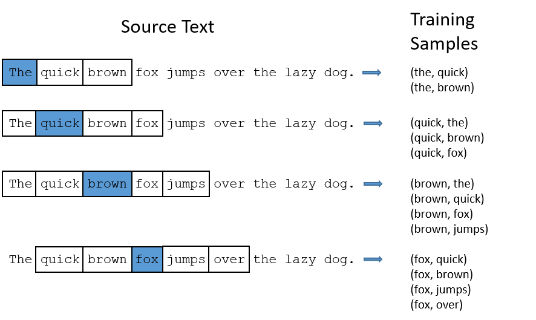

# SIC_Plagiarism_Detector
Plagiarism_Detector

      "application/vnd.jupyter.widget-state+json": {
        "state": {},

<h1>WordCloud</h1>

Tìm tần suất của các từ xuất hiện nhiều nhất
Mục đích cuối cùng của mình là tạo ra một chiếc word cloud thống kê tần suất xuất hiện và từ loại của các từ phổ biến trong đoạn văn bản. Vì vậy việc đầu tiên cần làm là thống kê tần suất và từ loại của những từ xuất hiện nhiều nhất.

<h1>SpaCy</h1>

Tách từ và phân đoạn câu (Tokenization và Sentence Segmentation)
Tách từ là bước rất quan trọng trong NLP, dùng để chia văn bản thành từng từ hoặc cụm từ nhỏ. Thuật toán tách từ của spaCy hiệu quả, tối ưu cho từng ngôn ngữ cụ thể, giúp tách chính xác và dễ dàng tùy chỉnh.

spaCy cũng có thể tự động phân đoạn văn bản thành từng câu, thuận tiện khi xử lý dữ liệu ở mức chi tiết hơn.

Nhận diện thực thể tên (Named Entity Recognition – NER)
Nhận diện thực thể tên là nhiệm vụ xác định và phân loại các thực thể như tên người, tổ chức, địa điểm, ngày tháng, tiền tệ, v.v.

Tính năng NER của spaCy rất mạnh mẽ, hỗ trợ sẵn cho nhiều ngôn ngữ. Người dùng cũng có thể huấn luyện mô hình NER theo dữ liệu riêng để nhận diện các thực thể đặc thù theo lĩnh vực.

Phân tích cú pháp quan hệ phụ thuộc (Dependency Parsing)
Phân tích phụ thuộc là quá trình xác định cấu trúc ngữ pháp của câu bằng cách tìm mối quan hệ giữa các từ.

Thư viện spaCy sử dụng thuật toán hiệu quả và có độ chính xác cao cho tác vụ này. Nó cung cấp tập chú thích cú pháp phong phú như từ chủ đạo (head), nhãn quan hệ (dependency label), và cấu trúc cây con (subtree structure).

Thông tin này rất hữu ích cho các nhiệm vụ như trích xuất thông tin, hệ thống hỏi đáp hoặc phân tích cảm xúc.

Tùy chỉnh và mở rộng (Customization and Extensibility)
Một trong những thế mạnh lớn của spaCy là tính linh hoạt. Lập trình viên có thể dễ dàng tùy chỉnh và tinh chỉnh mô hình để phù hợp với từng lĩnh vực hoặc cải thiện hiệu suất cho bài toán cụ thể.

Thư viện cũng cung cấp API rõ ràng để thêm các thành phần tùy chỉnh như bộ tách từ, trình nhận dạng thực thể hoặc bộ phân tích cú pháp mới, khiến spaCy trở thành công cụ lý tưởng cho nghiên cứu và phát triển.

Hiệu năng và khả năng mở rộng (Performance and Scalability)
spaCy nổi tiếng với hiệu suất xử lý cao và khả năng mở rộng. Thư viện được xây dựng bằng Cython – một ngôn ngữ biên dịch mã Python thành mã C/C++ hiệu quả. Nhờ đó, spaCy xử lý văn bản cực nhanh, phù hợp cho các ứng dụng NLP quy mô lớn và thời gian thực.

Ngoài ra, thư viện SpaCy cung cấp một pipeline xử lý NLP hiệu quả với các thành phần (components) có thể tùy chỉnh như:

Tokenization: Tách văn bản thành các token (từ, dấu câu) cực kỳ nhanh và hiệu quả, có xử lý các trường hợp đặc biệt.
Part-of-Speech (POS) Tagging: Gán nhãn từ loại cho từng token.
Dependency Parsing: Phân tích quan hệ phụ thuộc ngữ pháp giữa các từ trong câu.
Lemmatization: Đưa từ về dạng gốc dựa trên từ loại (lemma).
Named Entity Recognition (NER): Nhận dạng và phân loại các thực thể tên (người, tổ chức, địa điểm…) với độ chính xác cao – đây là một trong những thế mạnh nổi bật của SpaCy.
Text Classification: Hỗ trợ xây dựng các pipeline phân loại văn bản hiệu quả.
Entity Linking (EL): Liên kết các thực thể được nhận dạng tới các mục trong cơ sở tri thức (knowledge base).
Rule-based Matching: Công cụ Matcher và PhraseMatcher mạnh mẽ để tìm kiếm các mẫu từ hoặc cụm từ dựa trên quy tắc.
Word Vectors & Similarity: Tính toán độ tương đồng ngữ nghĩa giữa các từ, cụm từ hoặc tài liệu dựa trên vector từ được huấn luyện sẵn.
Custom Components: Cho phép người dùng dễ dàng thêm các thành phần xử lý tùy chỉnh vào pipeline.
XEM THÊM:  Scala Là Gì? Những Điều Cần Biết Về Ngôn Ngữ Lập Trình Scala
So sánh giữa spaCy và NLTK
Ngoài spaCy, NLTK (Natural Language Toolkit) cũng là một thư viện NLP rất phổ biến trong Python. Tuy nhiên, hai thư viện này có những điểm khác biệt quan trọng.

Trước hết, spaCy tập hợp các thuật toán được chọn lọc và tinh chỉnh cho từng bài toán cụ thể. Những thuật toán này được thư viện quản lý và cập nhật thường xuyên.

Ngược lại, NLTK cho phép người dùng chọn từ một danh sách lớn các thuật toán, tùy thuộc vào mục tiêu cụ thể.

<h1>Word2Vec</h1>

Skip-gram: Dự đoán những từ ngữ cảnh(output là context words) nếu biết trước từ đích (input là target words).

CBOW (Continuous Bag of Words): Dựa vào những từ ngữ cảnh để dự đoán từ đích. (*ngược lại với Skip-gram)